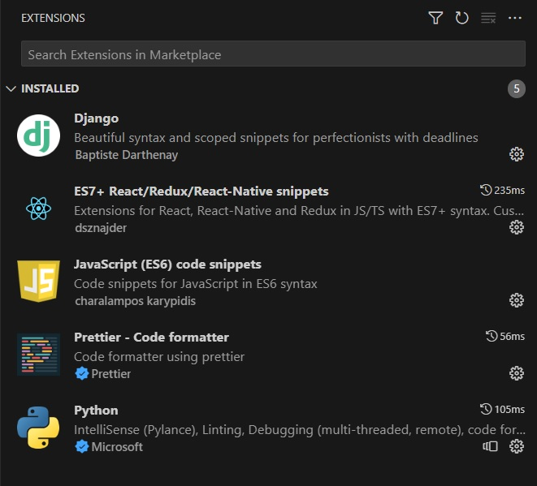
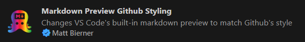

# Development Setup
### VS Code
[Download VS Code](https://code.visualstudio.com/)
### Git
[Download Git](https://git-scm.com/downloads)
### Python 3.12.0
Python has a new version as of 10/02/2023, and it has bug fixes, so we are currently using 3.12.0.  We also need Python to install django.
* [Download Python | Python.org](https://www.python.org/downloads/)
* **NOTE:** when downloading Python, pip can also be installed under optional features. Because pip is also required, if you did not choose to install pip, follow the [pip documentation](https://pip.pypa.io/en/stable/installation/).

Check if successfully installed:
```
py --version
pip --version
```
**NOTE:** If VS Code doesn't recognize python, then you may need to restart it.

(Optional) You can install pipenv if you want to use a virtual environment and not have a ton of packages everywhere
```
pip install pipenv
```
If it doesn't work, try  uninstalling it then running:
```
py -m pip install pipenv
```

At this point log into git and clone the repository if you haven't down so already. Then install the python packages used by the app, run one of the two following commands:
```
pip install -r requirements.txt
```
```
pipenv run pip install -r requirements.txt
```
**NOTE:** We might consider moving this into a docker container.

If you use pipenv, make sure to activate the environment using:
```
py -m pipenv shell
```

### Node.js
We need node.js to install React. As of 10/04/2023, the version we are using is v18.18.0.
* [Download | Node.js](https://nodejs.org/en/download)

### Django
Django is already in the requirements.txt, but if you need to reinstall, try:
```
pip install Django==4.2.5
```


Check if successfully installed:
```
django-admin --version
```

### Run migrations
```
cd tmdb-app
```
```
py manage.py migrate
```

### Run npm
Return to the root folder, then run:
```
cd frontend
```
```
npm install
```

### Start the app
Return to the root folder, then run:
```
.\scripts\start-app
```
If you installed the python packages to pipenv, run:
```
.\scripts\pipenv-start
```

### OPTIONAL VS Code Extensions
The following extensions may be useful:



This extension is useful to preview how markdown files will look in GitHub.


